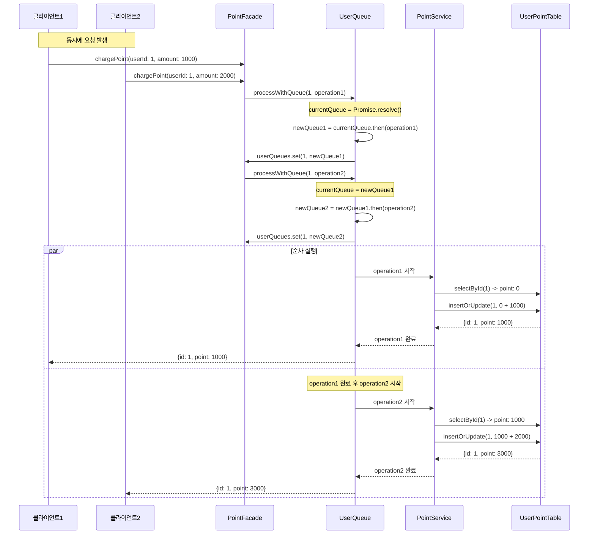
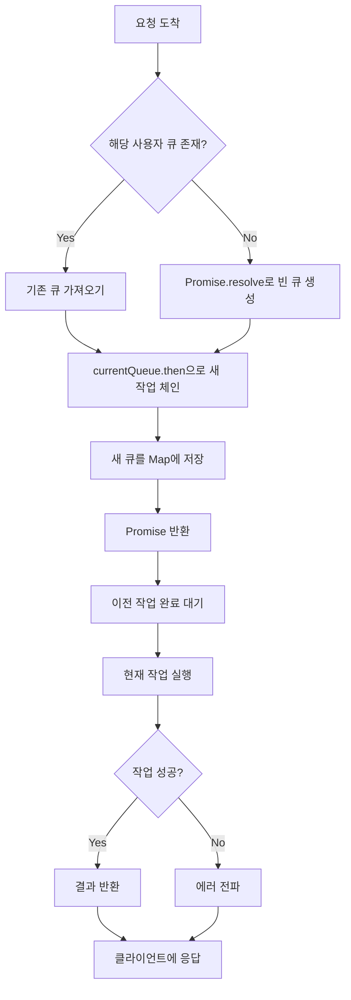

## 과제 수행 절차

### `STEP01 - 기능 추가 및 테스트 구현`

- 포인트 충전, 사용에 대한 정책 추가 (잔고 부족, 최대 잔고 등)
- 4가지 기본 기능 (포인트 조회, 포인트 충전/사용 내역 조회, 충전, 사용)에 대한 구현
- 4가지 기본 기능에 대한 테스트 작성
- 단, 이때 `/database` 패키지의 구현체는 수정하지 않고, 이를 활용해 기능을 구현함

### `STEP02- 동시성 학습 및 구현`

- 동일한 사용자에 대한 동시 요청에 대한 테스트를 먼저 작성함
- 이후 해당 테스트가 정상적으로 처리될 수 있도록 개선함
- **선택한 언어에 대한** 동시성 제어 방식 및 각 적용의 장/단점을 기술한 보고서 작성


## 과제 요구사항

`point` 패키지의 TODO 와 테스트코드를 작성해주세요.

### API 요구사항

- [X] PATCH  `/point/{id}/charge` : 포인트를 충전한다.
- [X] PATCH `/point/{id}/use` : 포인트를 사용한다.
- [X] GET `/point/{id}` : 포인트를 조회한다.

### 기능 요구사항

- [X] GET `/point/{id}/histories` : 포인트 내역을 조회한다.
- [X] 잔고가 부족할 경우, 포인트 사용은 실패하여야 합니다.

### 🚀Level-UP

- [X] 같은 사용자가 동시에 충전할 경우, 해당 요청 모두 정상적으로 반영되어야 합니다.

## 동시성 제어 방식 비교

### (1) Queue 기반 방식

개념: 사용자별 요청 큐를 생성하여 순차 처리

```typescript
// 사용자별 큐 관리
private userQueues = new Map<number, Promise<any>>();

async processWithQueue(userId: number, operation: () => Promise<any>) {
  const currentQueue = this.userQueues.get(userId) || Promise.resolve();
  const newQueue = currentQueue.then(() => operation());
  this.userQueues.set(userId, newQueue);
  return newQueue;
}
```

장점
- 구현이 간단하고 직관적
- 데이터 일관성 100% 보장
- 순서 보장으로 예측 가능한 결과
- 메모리 기반 DB에 적합

단점
- 처리 시간이 길어질 수 있음 (순차 처리)
- 첫 번째 요청이 실패하면 후속 요청 지연
- 메모리 사용량 증가 (큐 관리)

### (2) Lock 기반 방식

사용자별 락을 사용하여 동시 접근 제어

```typescript
// 사용자별 락 관리
private userLocks = new Map<number, boolean>();

async processWithLock(userId: number, operation: () => Promise<any>) {
  while (this.userLocks.get(userId)) {
    await new Promise(queueMicrotask(resolve));
  }
  this.userLocks.set(userId, true);
  try {
    return await operation();
  } finally {
    this.userLocks.set(userId, false);
  }
}
```

장점
- 빠른 처리 속도
- 리소스 사용량 최소화
- 실패한 요청이 다른 요청에 영향 없음

단점
- 구현 복잡도 증가
- 데드락 위험성
- 락 관리 오버헤드

### 3. Atomic 연산 방식

원자적 연산을 통한 동시성 제어

```typescript
async atomicUpdate(userId: number, updateFn: (current: number) => number) {
  const current = await this.getUserPoint(userId);
  const newValue = updateFn(current.point);
  return await this.updatePoint(userId, newValue);
}
```

장점:
- 가장 빠른 처리 속도
- 구현이 상대적으로 간단
- 시스템 리소스 최소 사용

단점:
- 복잡한 비즈니스 로직에 적용 어려움
- 현재 구조에서는 제한적 활용
- 부분 실패 시 롤백 복잡

## 의사결정을 해보자

현재 프로젝트 특성을 고려할 때 Queue 기반 방식이 적합하지 않을까?
단순하고, 테스트 작성과 검증이 용이하고, 동시성 제어 개념 이해에 적합하고, 향후 실제 DB 환경으로 확장 시 다른 방식으로 변경 가능하다.

## Queue 기반 동시성 제어 구현하기

### `PointFacade.processWithQueue` 메서드 동작 원리

```typescript
private async processWithQueue<T>(
  userId: number,
  operation: () => Promise<T>,
): Promise<T> {
  const currentQueue = this.userQueues.get(userId) ?? Promise.resolve();
  const newQueue = currentQueue.then(async () => {
    try {
      return await operation();
    } catch (error) {
      throw error;
    }
  });
  
  this.userQueues.set(userId, newQueue);
  return newQueue;
}
```



### 동작 흐름도



### 동시성 제어 예시

```typescript
// 동시에 3개 요청이 들어온 경우
const promise1 = facade.chargePoint(1, 100);  // 즉시 실행
const promise2 = facade.chargePoint(1, 200);  // promise1 완료 후 실행
const promise3 = facade.chargePoint(1, 300);  // promise2 완료 후 실행

// 실행 순서: 0 → 100 → 300 → 600
await Promise.all([promise1, promise2, promise3]);
```

### 테스트 결과

구현된 Queue 기반 동시성 제어는 다음과 같은 시나리오에서 모두 성공했습니다

1. 기본 동시 충전: 1000 + 2000 = 3000 ✅
2. 다중 동시 충전: 100 → 300 → 600 → 1000 → 1500 ✅
3. 충전/사용 혼합: 1000 → 1500 → 1300 → 1600 → 1500 ✅
